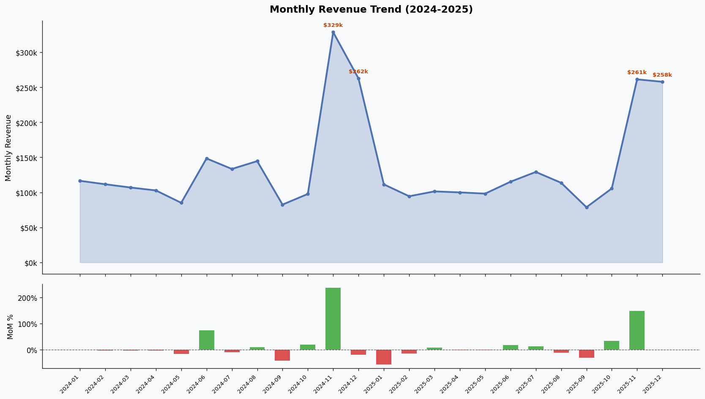

# RevenueLens 📊

**An end-to-end e-commerce sales analytics pipeline & interactive executive dashboard.**

[](https://www.python.org/)
[](https://www.sqlite.org/)
[](https://streamlit.io/)
[](LICENSE)

---

## 🎯 Executive Overview

E-commerce businesses process thousands of transactions daily but often struggle to extract timely, actionable intelligence. **RevenueLens** bridges raw operational transactional logs and strategic executive decision-making. 

It models a multi-year e-commerce ecosystem (~1,000 customers, 5,000 orders, 9,600+ line items) and surfaces core business insights:
- **Revenue Growth & Seasonality** (MoM trends, Q4 holiday surges)
- **Product Portfolio Performance** (Revenue leaders vs. Gross Margin percentage leaders)
- **Geographic & Category Contribution** (Regional spend skew, vertical revenue shares)
- **Customer Lifecycle Analytics** (RFM Segmentation, Cohort Retention Heatmaps, Repeat Purchase Rates)

---

## 💡 What I Learned & Key Takeaways

Building RevenueLens provided hands-on experience across the entire data engineering and analytics stack:

### 1. Advanced SQL & Analytical Queries
- **Window Functions for Growth Analytics**: Utilized `LAG() OVER (ORDER BY year_month)` to calculate true Month-over-Month (MoM) revenue growth percentages across 24 consecutive months.
- **RFM Customer Segmentation**: Built dynamic quartile scoring using `NTILE(4)` across Recency, Frequency, and Monetary dimensions to classify customers into actionable cohorts (*Champions*, *Loyal*, *At Risk*, *Lost*).
- **Cohort Retention Funnels**: Structured complex CTE joins comparing customer `signup_month` against subsequent `order_month` periods (`period_number 0..11`) to compute lifecycle retention rates.

### 2. Data Engineering & Synthetic Pipeline Design
- **Reproducible Data Generation**: Used Python (`pandas`, `numpy`, `Faker`) with deterministic random seeding (`SEED = 42`) to simulate realistic customer churn, regional distribution skews (West > East > South > Midwest), and weighted seasonal spikes (3x surge during Nov–Dec holiday periods).
- **Relational Schema & SQLite Optimization**: Designed normalized schema tables (`customers`, `products`, `orders`, `order_items`) with explicit foreign key constraints and strategic indexes (`idx_orders_customer`, `idx_orders_date`, `idx_items_order`) for sub-millisecond query execution.

### 3. Executive Dashboarding & Glassmorphism UI
- **Streamlit & Plotly Integration**: Created a reactive analytics dashboard featuring interactive filters (Date range, Region, Product Category) powered by cached SQL execution (`@st.cache_data`).
- **Dual Light & Dark Glassmorphism Themes**: Developed custom CSS themes featuring refractive frosted glass panels (`backdrop-filter: blur()`), inset light edge highlights, smooth hover transitions, and dark/light mode toggling.

---

## 📊 Key Business Insights (Data-Backed)

| Metric / Analysis | Insight | Actionable Decision |
| :--- | :--- | :--- |
| **Holiday Revenue Surge** | November MoM revenue jumped **+147.5%**, with Nov–Dec representing ~35% of total annual revenue. | Lock in inventory and ramp up acquisition campaigns starting in early October. |
| **Home & Garden Dominance** | Generated **$808K (24.6% revenue share)**, outperforming Electronics (**$633K**). | Expand catalog depth in high-AOV Home & Garden SKUs; negotiate volume pricing. |
| **Regional Distribution Skew** | West region led at **$1.09M**, while Midwest under-indexed (**$489K**) relative to customer count. | Launch targeted Midwest regional promotions to boost order frequency. |
| **Customer At-Risk Segment** | **329 customers (~34% of active base)** sit in *At Risk*, *Lost*, or *Needs Attention* RFM segments. | Deploy automated win-back email sequences offering time-limited discounts. |
| **Repeat Purchase Health** | Achieved an **89.0% repeat purchase rate** with an average of **4.4 orders per customer**. | Maintain strong post-purchase engagement and introduce a customer loyalty referral program. |

---

## 📁 Repository Structure

```
RevenueLens/
├── data/
│   ├── customers.csv        # 1,000 synthetic customers across 4 regions
│   ├── products.csv         # 120 SKUs across 5 core categories
│   ├── orders.csv           # 5,000 orders over a 2-year period
│   ├── order_items.csv      # ~9,600 individual line items
│   └── revenuelens.db       # Relational SQLite database
├── sql/
│   └── queries.sql          # 7 business intelligence queries (CTEs, Window functions)
├── notebooks/
│   └── analysis.ipynb       # Jupyter notebook with queries, visual charts & insights
├── dashboard/
│   └── dashboard.py         # Streamlit glassmorphic dashboard (Light & Dark mode)
├── generate_data.py         # Synthetic data pipeline script
├── load_db.py               # CSV to SQLite database loader
├── requirements.txt         # Pinned project dependencies
└── README.md                # Project documentation
```

---

## ⚡ Quick Start & Setup

### 1. Clone & Install Dependencies
```bash
git clone https://github.com/YogirajXD/RevenueLens.git
cd RevenueLens
pip install -r requirements.txt
```

### 2. Generate Synthetic Dataset
```bash
python generate_data.py
```

### 3. Load Data into SQLite Database
```bash
python load_db.py
```

### 4. Launch Interactive Dashboard
```bash
streamlit run dashboard/dashboard.py
```
> Access the live local dashboard at `http://localhost:8501`.

---

## 📈 Dashboard Screenshots



---

## 🚀 Future Roadmap

- [ ] **Real API Integration**: Connect pipeline directly to Shopify / WooCommerce REST APIs.
- [ ] **Machine Learning Churn Prediction**: Train XGBoost model on RFM features to calculate churn probability scores.
- [ ] **Automated Reporting**: Deploy Airflow DAGs for weekly email executive summaries via SendGrid.
